# E-Learning LMS - Complete System Design

## 🏗️ High-Level System Architecture

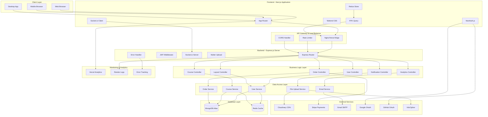

## 🔄 Data Flow Architecture

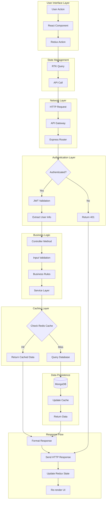

## 🔐 Authentication & Authorization Flow

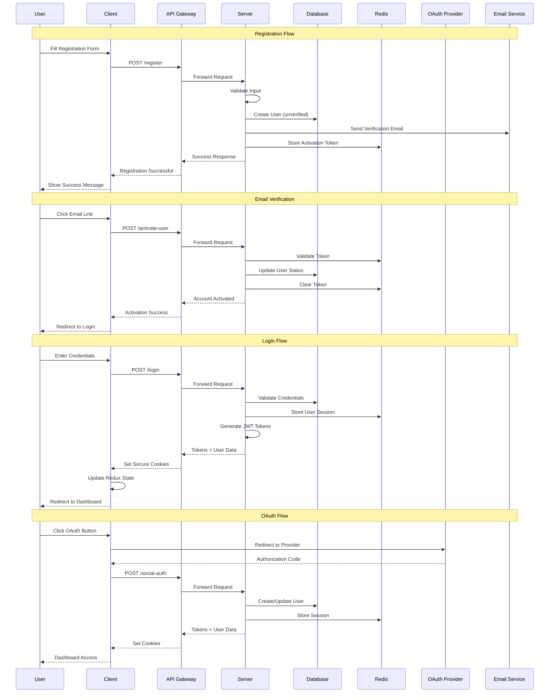

## 🎯 Microservices Architecture

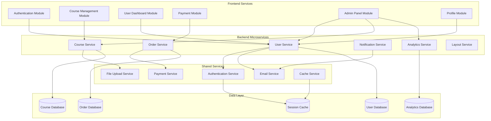

## 🗄️ Database Design & Relationships

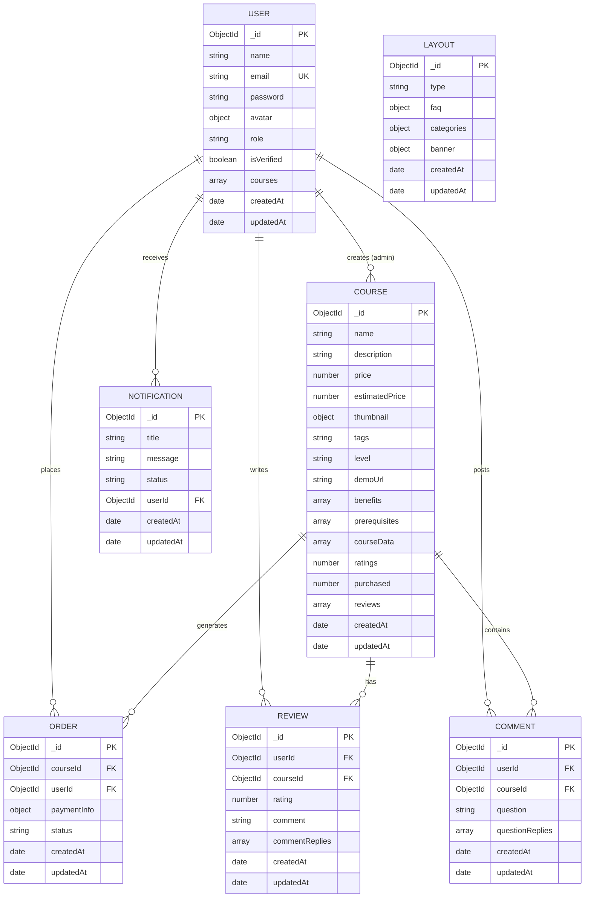

## 🌐 Network Architecture & CDN

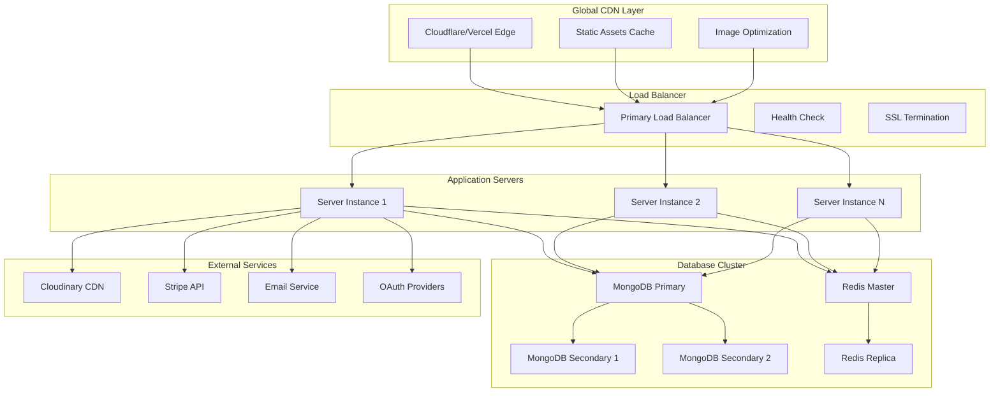

## 🔧 Development & Deployment Pipeline

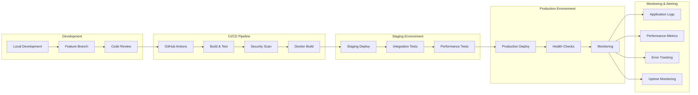

## 📱 Mobile-First Architecture

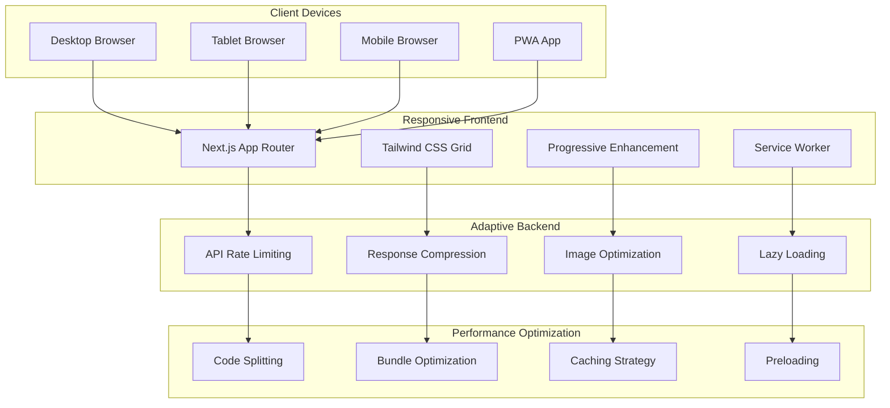

## 🛡️ Security Architecture

```mermaid
graph TB
    subgraph "Frontend Security"
        A1[Input Sanitization]
        A2[XSS Protection]
        A3[CSRF Protection]
        A4[Content Security Policy]
    end
    
    subgraph "Transport Security"
        B1[HTTPS/TLS 1.3]
        B2[Certificate Pinning]
        B3[HSTS Headers]
        B4[Secure Cookies]
    end
    
    subgraph "API Security"
        C1[JWT Authentication]
        C2[Rate Limiting]
        C3[Input Validation]
        C4[Output Encoding]
    end
    
    subgraph "Database Security"
        D1[Connection Encryption]
        D2[Access Control]
        D3[Query Sanitization]
        D4[Backup Encryption]
    end
    
    subgraph "Infrastructure Security"
        E1[Firewall Rules]
        E2[Network Segmentation]
        E3[Intrusion Detection]
        E4[Security Monitoring]
    end
    
    A1 --> B1
    A2 --> B2
    A3 --> B3
    A4 --> B4
    
    B1 --> C1
    B2 --> C2
    B3 --> C3
    B4 --> C4
    
    C1 --> D1
    C2 --> D2
    C3 --> D3
    C4 --> D4
    
    D1 --> E1
    D2 --> E2
    D3 --> E3
    D4 --> E4
```

## 📊 Analytics & Monitoring Architecture

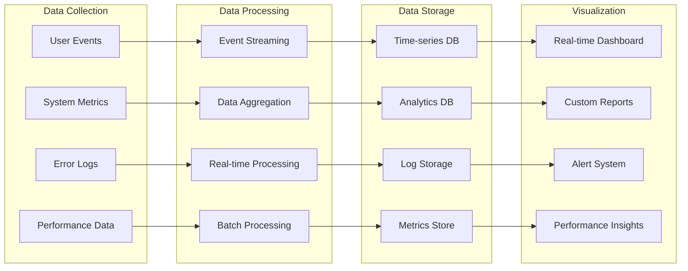

## 🔄 Real-time Communication Architecture

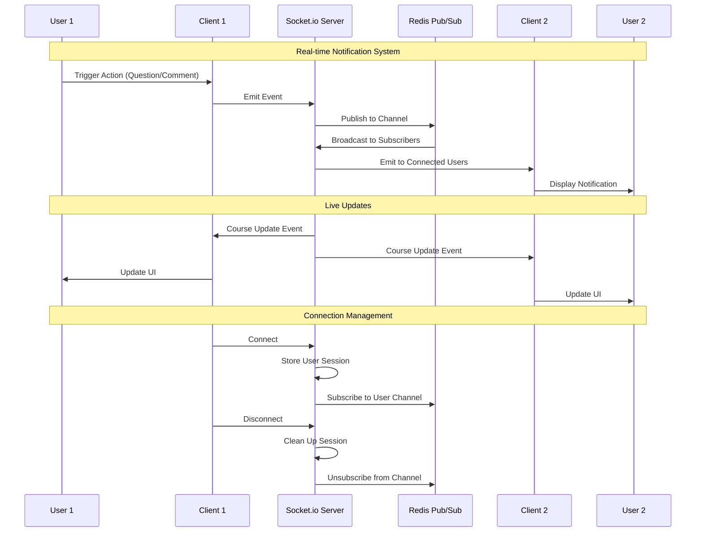